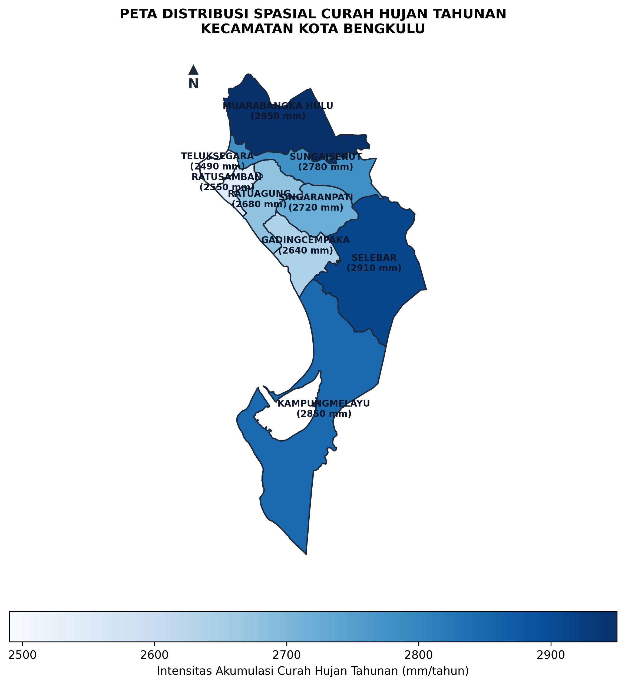
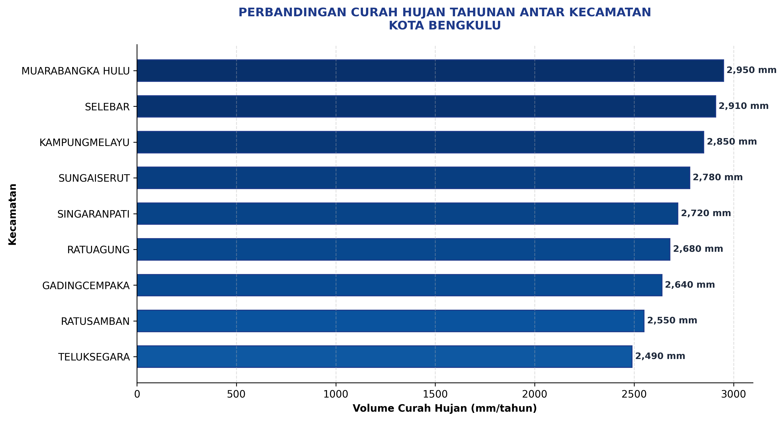

# analisis-curah-hujan-bengkulu-python

Program ini digunakan untuk:
* Membaca data shapefile kecamatan
* Membaca data curah hujan CSV
* Melakukan *spatial join*
* Membuat peta *choropleth*
* Membuat grafik batang
* Menyimpan hasil PNG

## 📥 Input Data
* `KOTA_BENGKULU.shp` (dan komponen file spasial pendukungnya)
* `Data_Hujan_Kecamatan.csv`

## 📤 Output Hasil
* `1_peta_curah_hujan_bengkulu.png`
* `2_grafik_curah_hujan_bengkulu.png`

## 🖼️ Visualisasi Hasil Analisis
### 1. Peta Curah Hujan Kota Bengkulu

### 2. Grafik Curah Hujan Per Kecamatan

